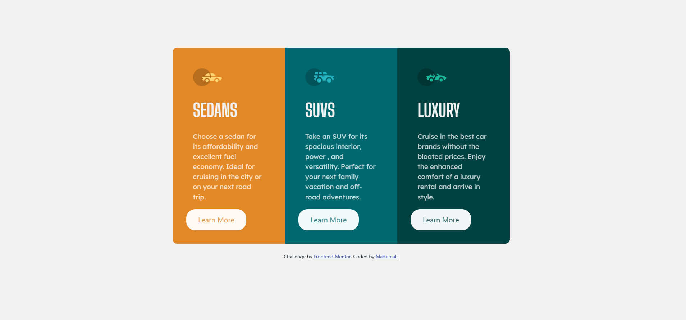

# Frontend Mentor - 3-column preview card component solution

This is a solution to the [3-column preview card component challenge on Frontend Mentor](https://www.frontendmentor.io/challenges/3column-preview-card-component-pH92eAR2-). Frontend Mentor challenges help you improve your coding skills by building realistic projects. 

## Table of contents

  - [The challenge](#the-challenge)
  - [Screenshot](#screenshot)
  - [Links](#links)
  - [Built with](#built-with)
  - [What I learned](#what-i-learned)
    - [Author](#author)


### The challenge

Users should be able to:

- View the optimal layout depending on their device's screen size
- See hover states for interactive elements

### Screenshot




### Links

- Solution URL: (https://www.frontendmentor.io/solutions/3columnpreviewcardcomponent-using-bootstrap-2MbXobuPHE)
- Live Site URL: (https://madushi-3-column-preview-card-compone.netlify.app/)


### Built with

- Semantic HTML5 markup
- CSS custom properties
- Mobile-first workflow
- [Styled Components](https://getbootstrap.com/docs/5.0/getting-started/introduction/) - Bootstrap 5 for styles 


### What I learned


```css
.btn {
  mix-blend-mode:screen;
}
```

## Author

- Frontend Mentor - [@yourusername](https://www.frontendmentor.io/profile/yourusername)

